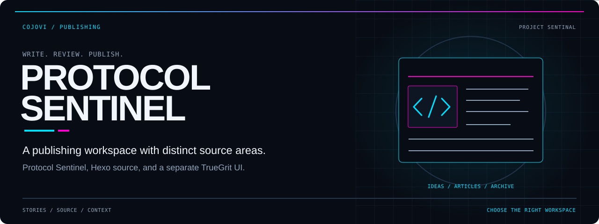
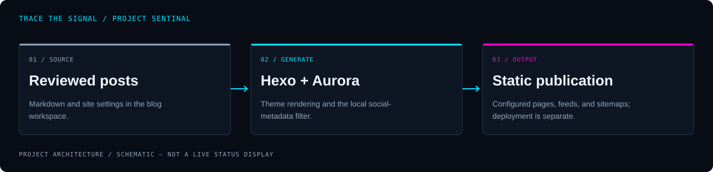

<!-- COJOVI / SIGNAL — Project Sentinal project edition. Keep readme-assets/ with this file. -->
<a name="top"></a>

<p align="center">
  
</p>

<h1 align="center">Project Sentinal</h1>

<p align="center">
  <strong>Write the story. Understand the tools. Choose the right workspace.</strong><br>
  Protocol Sentinel blog content, Hexo framework source, and a separate TrueGrit application share this repository.
</p>

<p align="center">
  
</p>

<p align="center">
  <a href="#overview">Overview</a> ·
  <a href="#architecture">Architecture</a> ·
  <a href="#quickstart">Quickstart</a> ·
  <a href="#configuration">Configuration</a> ·
  <a href="#usage">Workspaces</a> ·
  <a href="#security">Security</a>
</p>

---

<a name="overview"></a>
## `> meet_the_workspace`

**[cojovi/projectsentinal](https://github.com/cojovi/projectsentinal) is a mixed-source workspace, not one uniformly packaged application.** Its publishing side combines a Hexo/Aurora blog named **Protocol Sentinel** with Python article helpers. The root retains the upstream Hexo framework package and test tree.

A separate React application under `src/` presents **TrueGrit**, a construction-management interface backed by Supabase. It is not the blog's administrative interface, and the root package does not currently provide its Vite startup scripts.

| Publish | Extend | Organize |
| :--- | :--- | :--- |
| Markdown posts, Aurora configuration, RSS, and social metadata. | Hexo core, plugin extension points, and framework tests. | TrueGrit pages for jobs, schedules, estimates, materials, crew, and photo records. |

> [!IMPORTANT]
> **Choose a workspace before installing or running anything.** The root `package.json` describes Hexo, while the tracked root lockfile describes a React/Vite starter. Do not treat `npm ci` at the root or an assumed `npm run dev` as a verified setup path. The blog has its own manifest; the frontend needs packaging reconciliation.

<a name="architecture"></a>
## `> trace_the_story`

<p align="center">
  
</p>

```text
Publishing path
  blog/source/_posts/ + blog/_config*.yml
                  ↓
  blog/package.json → Hexo + Aurora + local metadata filter
                  ↓
  blog/public/ → static pages, theme data, RSS, and sitemaps

Separate source areas
  lib/ + test/           Hexo framework development
  src/ + supabase/       TrueGrit UI and database migrations
  Python helpers        optional provider-backed article generation
```

The diagram describes the **configured publishing path**, not a deployment pipeline. `blog/_config.yml` resolves `public_dir: public` relative to the blog directory. The separately tracked root [public/](public/) is an existing generated snapshot, not proof that a fresh blog build updates that location.

[opengraph.js](blog/scripts/opengraph.js) injects missing Open Graph and Twitter metadata after HTML rendering. Optional article helpers write source files; they are not required to read or manually edit the blog.

<a name="quickstart"></a>
## `> prepare_the_blog`

**Prerequisites:** Git, a text editor, and a Node.js/npm environment compatible with the blog's resolved dependencies. The root Hexo manifest declares Node `>=14`; this is not a tested minimum for every component in this mixed repository.

### 1. Clone the exact repository

```bash
git clone --branch main https://github.com/cojovi/projectsentinal.git
cd projectsentinal
```

Keep the repository spelling `projectsentinal`; the blog's display name is **Protocol Sentinel**.

### 2. Review settings before previewing

Read [blog/_config.yml](blog/_config.yml) and [blog/_config.aurora.yml](blog/_config.aurora.yml). Replace site identity and deployment-specific URLs in your own copy. Review analytics, comments, injected scripts, external links, and content rights before loading a preview in a browser.

The theme entry at `blog/themes/aurora` is a relative symlink into `blog/node_modules/hexo-theme-aurora`. It is not a vendored theme checkout. Dependency installation must supply the target, and symlink behavior should be checked on your platform.

### 3. Use the blog's own package

After that review, these are the blog manifest's local development commands:

```bash
cd blog
npm install
npm run server -- --ip 127.0.0.1
```

Use the local address reported by Hexo. Installing dependencies may run package lifecycle scripts; review those in an environment you control. These instructions do not install or start the TrueGrit frontend.

The blog also defines `npm run build` for static generation and `npm run clean` for generated-file cleanup. Its `deploy` script exists, but `deploy.type` is empty in the reviewed configuration; no working deployment destination is established here.

<a name="configuration"></a>
## `> set_the_context`

| Area | Source of truth | What to review |
| :--- | :--- | :--- |
| Blog identity | [Main config](blog/_config.yml) | Title, URL, permalinks, feed, sitemap, and output directory. |
| Theme | [Aurora config](blog/_config.aurora.yml) | Menu, authors, social links, comments, injections, and metadata. |
| Sharing metadata | [Local filter](blog/scripts/opengraph.js) | Cover-image selection, descriptions, and generated tags. |
| Framework build | [Root manifest](package.json) and [tsconfig.json](tsconfig.json) | TypeScript in `lib/` compiles into `dist/`. |
| Frontend connection | [Client loader](src/lib/supabase.ts) | `VITE_SUPABASE_URL` and `VITE_SUPABASE_ANON_KEY`. |
| Database | [Migrations](supabase/migrations/) | Schema, seeds, policies, and identity-specific changes. |

The [.env.example](.env.example) also lists `VITE_APP_NAME` and `VITE_APP_VERSION`. Do not assume those labels change the hardcoded UI identity. A Supabase browser key is not an authorization policy; never place a service-role key in a `VITE_` variable.

### Optional article tooling

- [create_article.py](create_article.py) uses `OPENAI_API_KEY`, optionally `TAVILY_API_KEY`, and can load a local `.env` through `python-dotenv`. It writes posts under `blog/source/_posts/` and generated artwork under `test/`.
- [requirements.txt](requirements.txt) belongs to those root Python helpers, not the React or Hexo dependency graph.
- [generate_post.py](blog/source/scripts/generate_post.py) is a different, issue-shaped generator with its own [requirements](blog/source/scripts/requirements.txt). It accepts `ISSUE_TITLE`, `ISSUE_BODY`, `ISSUE_NUMBER`, `POSTS_DIR`, `DEFAULT_MODEL`, and provider settings; `LOCAL_LLM_URL` is its fallback when no OpenAI key is present.
- `POSTS_DIR` in that helper is resolved from the process working directory. Review paths rather than launching it from an arbitrary folder.

No AI credentials are needed for manual Markdown editing. Provider use can transmit input and source material off-machine and incur charges.

<a name="usage"></a>
## `> choose_your_lane`

### Blog authoring

Edit posts in [blog/source/_posts/](blog/source/_posts/) and check their YAML front matter, categories, tags, and image references. Review generated prose and sources before publication. The current configuration enables future-dated posts and does not render drafts by default.

RSS is configured as `rss.xml`; tag/category sitemap entries are disabled in the main sitemap settings. Verify generated output rather than assuming the existing root snapshot reflects current configuration.

### Hexo framework development

The root package remains named `hexo`, with the `hexo` CLI entry at [bin/hexo](bin/hexo). After reconciling the root manifest and lockfile in a separate development change, the declared commands are:

```bash
npm run build
npm run eslint
npm test
```

`npm test` invokes a pretest clean/build before the Mocha suite. These commands target Hexo, not frontend tests. The root `prepare` script installs Husky hooks, and the pre-commit hook runs `lint-staged`.

### TrueGrit source exploration

[App.tsx](src/App.tsx) places dashboard, jobs, schedule, estimates, communities, floorplans, materials, crew, photos, reports, and settings routes behind its authentication wrapper. Pages include real Supabase reads and inserts, but not every visible control is wired.

For example, [Photos.tsx](src/pages/Photos.tsx) records an existing image URL; its “Upload” label does not implement binary file storage. [Reports.tsx](src/pages/Reports.tsx) calculates job charts, while its additional report buttons have no action handlers. Dashboard growth percentages are static text.

A missing Supabase configuration leaves the auth user unset, so the wrapper shows login; dashboard fallback values do not constitute a usable, signed-in offline demo. Restore the frontend dependency manifest and review database authorization before attempting a separate frontend setup.

<a name="validation"></a>
## `> verify_each_lane`

**Application builds and tests were not run for this documentation work.** The following are maintainer checks, not passing results:

- [ ] Reconcile the root manifest and lockfile before framework installation.
- [ ] Verify the blog theme symlink and installed theme package.
- [ ] Preview blog routes, feeds, image references, and social metadata locally.
- [ ] Confirm the intended output directory before copying generated files.
- [ ] Review external scripts, provider settings, and content ownership.
- [ ] Restore a coherent frontend package and verify its actual build separately.
- [ ] Test Supabase policies and role changes against an isolated database.
- [ ] Distinguish working controls from display-only placeholders.
- [ ] Run the appropriate framework or helper tests only after reviewing their scope.

No root GitHub Actions workflow is tracked. `blog/.github/dependabot.yml` is nested configuration, not an active root workflow or a deployment guarantee.

<a name="source-map"></a>
## `> explore_the_source`

| Path | Responsibility |
| :--- | :--- |
| [lib/](lib/) · [test/](test/) | Hexo framework and tests; `test/` also contains media. |
| [blog/](blog/) | Blog manifest, configuration, source posts, and theme link. |
| [public/](public/) | Tracked generated website snapshot. |
| [archived_blogs/](archived_blogs/) | Archived article sources. |
| [src/](src/) · [supabase/](supabase/) | Separate construction UI and database migrations. |
| [CLAUDE.md](CLAUDE.md) | Historical maintenance guidance; reconcile against current source. |
| [ARTICLE_GENERATOR_README.md](ARTICLE_GENERATOR_README.md) | Helper documentation; verify model and execution details in Python source. |

<a name="security"></a>
## `> protect_the_edges`

- **Keep publication deliberate.** `create_article_git.py` and `protocol_sentinal_blog_creator.py` contain automatic Git add/commit/push paths. They are not safe read-only preview commands.
- **Review database policy changes.** Some migrations introduce broad authenticated access. Client-side role checks, identity-specific admin handling, and displayed demo credentials must not be treated as production authorization.
- **Do not run seed migrations blindly.** They include identity-specific records and privilege changes. Use sanitized data and a separate database after reviewing every migration.
- **Keep private values private.** Do not copy source identities, credentials, analytics identifiers, operational endpoints, or generated personal records into public documentation or test fixtures.

### Attribution and license

The repository is not marked as a GitHub fork, but it retains **[Hexo](https://github.com/hexojs/hexo)** source and package identity. The root **[MIT license](LICENSE)** carries **Copyright (c) 2012-present Tommy Chen**; preserve that notice and applicable third-party notices. Aurora, React, Supabase, and provider services are separate projects. Verify rights for article and media content independently.

---

<p align="center">
  
</p>

<p align="center">
  <strong>Clear workspaces. Reviewed stories. Deliberate publication.</strong><br>
  <sub>A <a href="https://github.com/cojovi">Cody / cojovi</a> workspace · <a href="https://cojovi.com">cojovi.com</a><br>
  Hexo upstream identity retained · Presented in COJOVI / SIGNAL.</sub>
</p>

<p align="center"><a href="#top">↑ Back to the signal</a></p>
